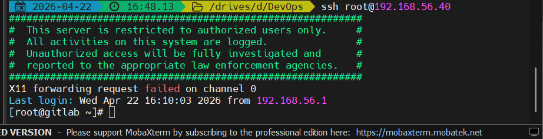
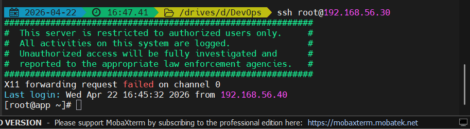
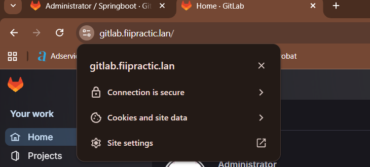
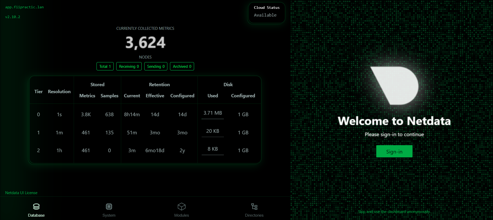
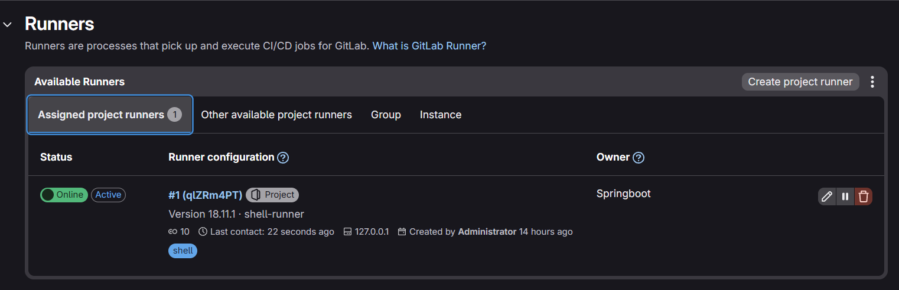
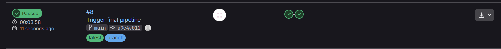

# Final DevOps Project — FiiPractic 2026

This is my final project for the FiiPractic DevOps 2026 course. I built from scratch a virtualized infrastructure with two servers, automated their configuration with Ansible, containerized a Spring Boot application with Docker, and set up a complete CI/CD pipeline on GitLab.

---

## Project Structure

```
.
├── Vagrantfile                  # VM definition and provisioning
├── inventory.ini                # Ansible hosts
├── common.yaml                  # Initial configuration playbook
├── deploy.yaml                  # Application deployment playbook
├── Dockerfile                   # Multi-stage Spring Boot build
├── .gitlab-ci.yml               # CI/CD pipeline
├── .gitignore                   # Excluded: certs, build artifacts, .vagrant
├── src/                         # Java application source code (Spring Boot)
├── build.gradle                 # Gradle build configuration
├── certs/                       # CA certificates folder (.crt/.key files not committed)
└── extras/
    ├── configure-gitlab.sh      # GitLab configuration script (HTTPS, SSL, Registry)
    ├── setup-easyrsa.sh         # CA and wildcard certificate generation script
    ├── bank.sh                  # CLI banking application
    ├── client.sh                # Netcat file transfer (client)
    ├── server.sh                # Netcat file transfer (server)
    ├── docker-compose.yml       # SpringBoot x2 + Nginx LB
    ├── nginx-lesson3.conf       # Security headers + maintenance
    ├── nginx-lesson4.conf       # Upstream + reverse proxy
    ├── maintenance.html         # Maintenance page
    ├── netdata.yaml             # Netdata + Nginx playbook
    └── escape-room/             # CTF Docker game (bonus)
```

---

## Infrastructure

I created two virtual machines using **Vagrant + VirtualBox**, both running **Rocky Linux 9**, defined in [Vagrantfile](Vagrantfile):

| VM | IP | Role | RAM | CPU |
|----|----|------|-----|-----|
| gitlab2 | 192.168.56.40 | GitLab CE, Runner, Ansible Controller | 6 GB | 4 |
| app2 | 192.168.56.30 | Application server (Docker) | 2 GB | 2 |

I modified the [Vagrantfile](Vagrantfile) beyond the initial requirements to automate the machine setup as much as possible. On `vagrant up`, provisioning automatically handles:
- Setting the root password and configuring SSH
- Installing Docker, git, vim
- Copying the GitLab CE and GitLab Runner repositories (`gitlab-ce.repo`, `gitlab-runner.repo`)
- Installing Ansible on gitlab2
- Configuring `/etc/hosts` on both machines

After `vagrant up`, the machines are ready to use with no additional manual configuration.

### SSH Security

Both machines have a **security banner** configured via [common.yaml](common.yaml), displayed at every SSH connection:




Authentication between machines is done exclusively via **SSH keys** (no password).

---

## GitLab CE with HTTPS

A self-hosted **GitLab CE** instance runs on gitlab2, accessible at `https://gitlab.fiipractic.lan`.

SSL certificates were generated with **easy-rsa** (custom CA) and include Subject Alternative Names for all project subdomains (`*.fiipractic.lan`). The connection is secured and validated by the browser.

GitLab also exposes a **Container Registry** on port 5050, used by the pipeline to store Docker images.



---

## Automation with Ansible

All server configuration is automated through Ansible playbooks. The Ansible controller runs on gitlab2 and connects to app2 via SSH, based on the [inventory.ini](inventory.ini) file.

### [common.yaml](common.yaml)

Initial configuration playbook run on **both machines**. Automates:
- Setting the timezone (Europe/Bucharest)
- Disabling SELinux and firewalld
- Configuring the SSH banner
- Installing and configuring Docker
- Copying the CA certificate to each server
- Installing GitLab CE and GitLab Runner on gitlab2

```bash
ansible-playbook -i inventory.ini common.yaml
```

### [deploy.yaml](deploy.yaml)

Application deployment playbook on app2. Called automatically by the CI/CD pipeline and performs:
1. Login to the GitLab Container Registry
2. Capturing the existing container's image ID (before the update)
3. Pulling the new image (tagged with commit SHA)
4. Stopping and removing the old container
5. Removing the old Docker image
6. Starting the new container
7. Verifying that the application is running

### [extras/netdata.yaml](extras/netdata.yaml) *(extra)*

Installs **Netdata** on app2 and configures an **Nginx reverse proxy** with HTTPS and Basic Auth.

```bash
ansible-playbook -i inventory.ini extras/netdata.yaml
```



---

## Docker — Spring Boot Application

### [Dockerfile](Dockerfile) multi-stage

The image is built in two stages to minimize the final size:

```dockerfile
# Stage 1: Build with Gradle
FROM gradle:7.6-jdk11 AS builder
WORKDIR /app
COPY DevOps-Project .
RUN chmod +x ./gradlew && ./gradlew build --no-daemon -x test

# Stage 2: Runtime — JRE only, no Gradle/JDK
FROM eclipse-temurin:8-alpine
WORKDIR /app
COPY --from=builder /app/build/libs/*.jar app.jar
EXPOSE 8080
ENTRYPOINT ["java", "-jar", "app.jar"]
```

---

## CI/CD Pipeline

The pipeline is defined in [.gitlab-ci.yml](../.gitlab-ci.yml) and runs automatically on every push to the `main` branch. It uses **GitLab CI/CD Templates** (`Workflows/Branch-Pipelines`) to control when the pipeline is triggered.

```
Push to main
     │
     ▼
┌─────────────┐     ┌──────────────┐
│ build-image │ --> │  deploy-app  │
│   (build)   │     │   (deploy)   │
└─────────────┘     └──────────────┘
```

**build-image** — Docker build + push to Container Registry with commit SHA tag

**deploy-app** — Ansible deploys the new container to app2

### GitLab Runner

Runner with **shell** executor, tag `shell`, registered on gitlab2.





---

## Extra Files

### [extras/docker-compose.yml](../extras/docker-compose.yml) + [extras/nginx-lesson4.conf](../extras/nginx-lesson4.conf)

Runs **2 instances of the Spring Boot application** with an **Nginx load balancer** in front (round-robin):

```bash
cd extras
docker compose up -d
```

### [extras/nginx-lesson3.conf](../extras/nginx-lesson3.conf) + [extras/maintenance.html](../extras/maintenance.html)

Nginx configuration with **security headers** (HSTS, CSP, X-Frame-Options) and a maintenance page that can be activated by simply creating a flag file.

### [extras/bank.sh](../extras/bank.sh)

Interactive Bash banking application: deposit, withdrawal, transfer between accounts, transaction history saved to CSV.

```bash
bash extras/bank.sh
```

### [extras/client.sh](../extras/client.sh) + [extras/server.sh](../extras/server.sh)

Network file transfer using **Netcat**:

```bash
# On server:
bash extras/server.sh 9999 received_file.txt

# On client:
bash extras/client.sh 192.168.56.30 9999 document.txt
```

### [extras/escape-room/](../extras/escape-room/) *(bonus)*

A **CTF (Capture The Flag)** game running in Docker — 4 rooms, each with a different puzzle:

| Room | Puzzle |
|------|--------|
| room1 | Find hidden files in the filesystem |
| room2 | Decode a Base64 message from logs |
| room3 | Find the flag among environment variables |
| room4 | Make an HTTP request to a secret container |

```bash
cd extras/escape-room
docker compose up -d --build
docker exec -it room1 sh
```

---

## Challenges Encountered

**Local network was blocking the 192.168.100.x subnet** — The initial IPs from the requirements (192.168.100.10/20) didn't work because the local network was blocking that subnet. Switched to 192.168.56.30/40 (Host-Only) which works independently of the external network.

**SSL certificate without Subject Alternative Names** — The first certificate generated with easy-rsa didn't include SANs, causing the browser to reject it. Regenerated the certificate directly with OpenSSL, explicitly specifying the required DNS names in a `san.cnf` file.

**ERR_SSL_KEY_USAGE_INCOMPATIBLE** — The new certificate failed due to an incompatible `dataEncipherment` attribute in HTTPS. Regenerated with `keyUsage = digitalSignature, keyEncipherment`.

**GitLab Runner without Docker access** — The build job failed with `permission denied` on `/var/run/docker.sock`. Added the `gitlab-runner` user to the `docker` group and restarted the runner.

**Pipeline triggered on CRLF files** — `.gitlab-ci.yml` created on Windows had CRLF line endings that invalidated it. Rewrote the file directly on Linux using a heredoc.

**Deploy failed with `No route to host`** — The app2 machine shut down during the session. After restarting, the pipeline passed green.

**Netdata — missing dependencies** — Native installation failed due to missing packages on Rocky Linux 9 (`libbson`, `libmongoc`). Used the `--non-interactive --stable-channel` flags in the playbook to use the precompiled binary from the stable channel.

**Insufficient RAM for gitlab2** — With 4 GB RAM (as per requirements), GitLab CE started but became extremely slow and some operations (reconfigure, pipelines) failed due to lack of memory. Had to increase gitlab2's RAM to 6 GB in the Vagrantfile to ensure stable operation of GitLab CE together with GitLab Runner.

**LVM — stale devices after disk resize** — `vgs` couldn't find the volume group after enlarging the disk. Deleted the stale devices file (`/etc/lvm/devices/system.devices`) and ran `vgscan`.

---

## Technologies

`Vagrant` `VirtualBox` `Rocky Linux 9` `GitLab CE` `GitLab Runner` `Ansible` `Docker` `Nginx` `Spring Boot` `Gradle` `easy-rsa` `Netdata` `Bash`
